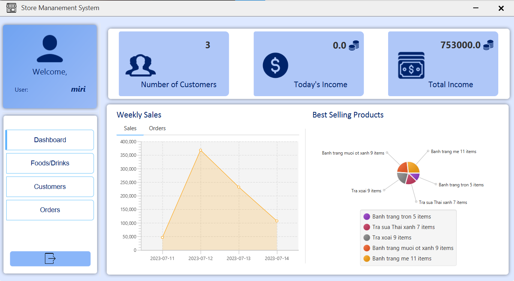
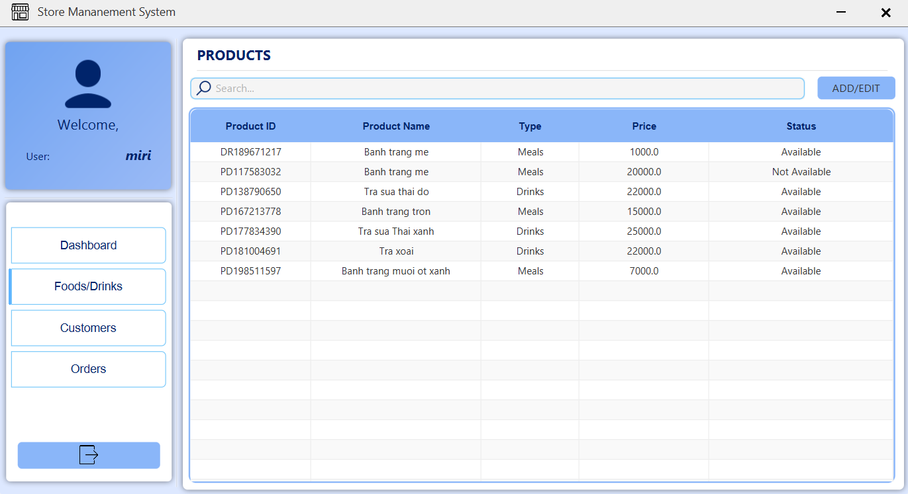
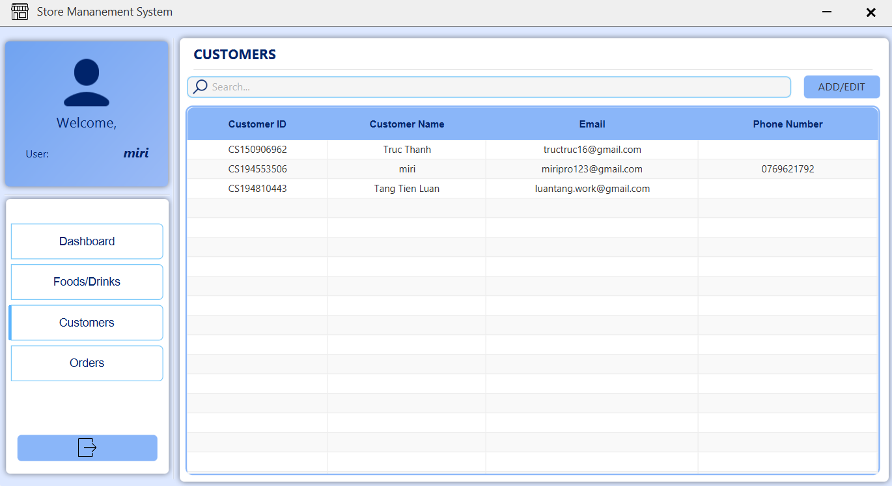
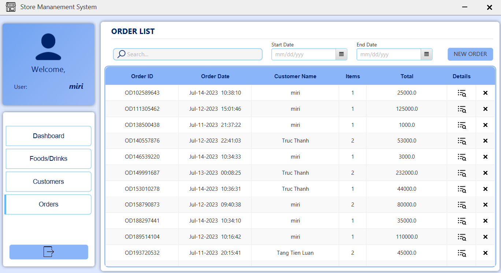

# **Store-Management-System (v1.0)**

Store Management System is a comprehensive solution that simplifies order,
product, and customer management. With an intuitive and comprehensive dashboard,
you can easily track important information and monitor the performance of your store.

## **Features**
- Dashboard: Access an overview of critical store information on our intelligent dashboard. Monitor total customers, today's and cumulative income, and track order quantities and daily income trends through informative charts.
- Order Management: Streamline your order processes. Search and filter orders based on keywords or order placement time. View detailed order information, including product details, customer information, and order value
- Product Management: Effortlessly manage your products. Add, delete, and edit product information with ease. Keep track of inventory levels and ensure accurate and up-to-date product information.
- Customer Management: Streamline customer information management. Add, delete, and edit customer profiles

## **Application guidelines**
- ### **Install the JDK 20.0.1**
  Window: <https://download.oracle.com/java/20/latest/jdk-20_windows-x64_bin.exe>

- ### **Download StoreMS.rar**
  Link: <https://github.com/luantang2102/Store-Management-System/releases>

## **Screenshot reviews**
- Login form:

- Dashboard:

- Products View:

- Customers View:

- Orders View:

## **Demo Video**
- [Youtube](https://www.youtube.com/watch?v=Zi7uG-7qrgo)

## **Contact**
- **FB** :  [Luan Tang](https://www.facebook.com/luantang21/)
- **Email** : Luantang.work@gmail.com
